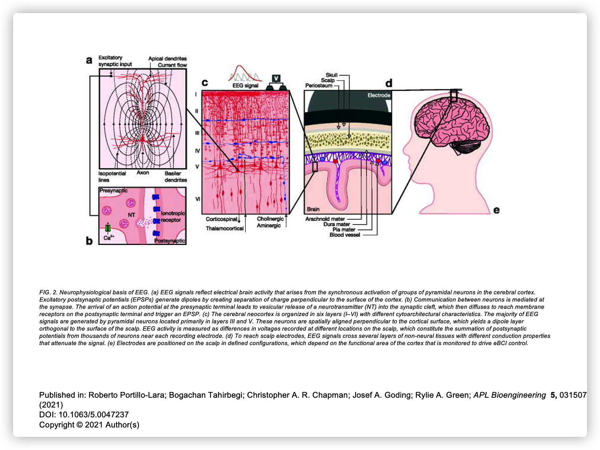

# **EEG简介**

## **什么是EEG？**

**脑电图**( **EEG** ) 是一种电生理监测方法，用于记录头皮上的电活动，已被证明代表了下方大脑表层的宏观活动。通常是非侵入性的，电极沿头皮放置。脑电图涉及侵入电极，有时也被称为颅内EEG。

EEG 技术的衍生物包括诱发电位(EP)，它涉及将时间锁定到某种刺激（视觉、体感或听觉）的呈现的 EEG 活动进行平均。事件相关电位(ERP) 是指对更复杂的刺激进行时间锁定的平均 EEG 反应；这种技术用于认知科学、认知心理学和心理生理学研究。

## **一、为什么要使用EEG**

### 医疗用途

脑电图是癫痫的主要诊断测试之一。常规临床脑电图记录通常持续 20-30 分钟（加上准备时间）。这是一种使用附着在头皮上的小金属圆盘（电极）检测大脑中电活动的测试。通常，脑电图在临床环境中用于确定大脑活动的变化，这可能有助于诊断脑部疾病，尤其是癫痫或其他癫痫症。脑电图也可能有助于诊断或治疗以下疾病：

- 脑肿瘤
- 头部受伤造成的脑损伤
- 可能有多种原因的脑功能障碍（脑病）
- 脑部炎症（脑炎）
- 中风
- 睡眠障碍

### 科学研究

EEG 和ERPs的相关研究广泛用于神经科学、认知科学、认知心理学、神经语言学和心理生理学研究，还用于研究吞咽等人类功能。研究中使用的许多脑电图技术没有足够标准化以供临床使用，许多 ERP 研究未能报告数据收集和减少的所有必要处理步骤，限制了可重复性和可复制性许多研究。但是对精神障碍的研究，例如听觉处理障碍（APD），ADD或ADHD正变得越来越广为人知，EEG用作研究和治疗。

## **二、EEG发展历程**

脑电的研究始于生物电的发现。 1786 年意大利博洛尼亚大学(Bologna Uni­versity)的解剖学教授 Galvani 观察到青蛙外周神经和肌肉的带电现象，由此发现了生物电，并创立了动物电(animal electricity)学说。 人们因此将其视为现代电生理学(electrophysiology)的奠基人。 在此后的半个多世纪里，电生理仪器得到不断改进。 1875 年，英国利物浦皇家医学院助教 Richard Caton（1842—1926)首先在兔脑上观察到了自发脑电反应，并同年 8 月，在英国《医学杂志》(Bri.tish Medical J our­nal)上以《脑的电流》为题发表了他的研究工作。 15 年后，波兰克拉科夫雅盖隆宁大学(Jagiellonian University of Krakow)的 Adolf Beck（1863—1942)也独立发现了狗和兔子的皮层脑电活动，并在他的博士论文中首次提出了脑电的去同步化过程的概念。这些早期的动物脑电研究无疑为人脑自发电活动的发现奠定了坚实的基础。

1912年，乌克兰生理学家Vladimir Vladimirovich Pravdich-Neminsky出版了第一本动物脑电图和诱发电位的的哺乳动物（狗）。1914 年，Napoleon Cybulski和 Jelenska-Macieszyna 拍摄了实验诱发癫痫发作的脑电图记录。

最早的人类头皮脑电图 ． 是德国耶那(Jena) 大学精神科教授 Hans Berger (1873-1941) 博士 1924 年在他的儿子头皮上获得的。 但出于谨慎，直到 5 年后，即 1929 年，他才将自己的研究成果公开发表。在此后近 10 年的时间里，他陆续发表了 14 篇同一标题的有关人类脑电图的论文，这些论文成为后续脑电研究工作的宝贵财富 。 Berger 首次记录到了人类的脑电活动，并第一次将脑电活动命名为electroencephalogram(EEG) 。 由千他在脑电研究上的卓越贡献，Berger 被后人称为 人类脑电图之父”。他的发现在 1934 年首先被英国科学家Edgar Douglas Adrian和 马修斯证实。

1934 年，Fisher 和 Lowenbach 首次展示了癫痫样尖峰。1935 年，Gibbs、Davis 和 Lennox 描述了发作间期棘波和临床失神发作的三个周期/秒模式，开创了临床脑电图领域。随后，在 1936 年，Gibbs 和 Jasper 报告了发作间期尖峰作为癫痫的病灶特征。同年，马萨诸塞州总医院开设了第一个脑电图实验室。

1947年，美国脑电图学会成立，并召开了第一届国际脑电图大会。1953 年 Aserinsky 和 Kleitman 描述了REM 睡眠。

在 1950 年代，William Gray Walter开发了一种称为EEG topography 的辅助工具，它允许绘制大脑表面的电活动图。

等。。。

## **三、EEG的神经生理基础**

大脑的电荷由数十亿个神经元维持。神经元被膜转运蛋白带电（或“极化”），这些蛋白通过离子泵穿过它们的膜。神经元不断地与细胞外环境交换离子，例如保持静息电位和产生动作电位。 具有相似电荷的离子相互排斥，当许多离子同时被推出许多神经元时，它们可以推动它们的周围电荷，后者推动他们的周围电荷，依此类推。这个过程被称为体积传导。当离子波到达头皮上的电极时，它们可以推动或拉动电极中金属上的电子。由于金属很容易传导电子的推拉，因此可以用电压表测量任意两个电极之间推拉电压的差异。随着时间的推移记录这些电压为我们提供了脑电图。

单个神经元产生的电势太小，无法被 EEG 或 MEG 检测到。因此，脑电图活动始终反映了具有相似空间方向的数千或数百万个神经元的同步活动的总和。如果细胞没有相似的空间方向，它们的离子不会排列并产生待检测的波。 皮质的锥体神经元被认为是产生最多的 EEG 信号，排列一致并同步传导。由于电压场梯度随距离的平方下降，因此深源的活动比头骨附近的电流更难检测。

脑电图的神经生理学基础。(a) EEG 信号反映大脑皮层锥体神经元群同步激活引起的脑电活动。兴奋性突触后电位 (EPSP) 通过产生垂直于皮层表面的电荷分离来产生偶极子。(b) 神经元之间的交流由突触介导。动作电位到达突触前末梢导致神经递质 (NT) 囊泡释放到突触间隙，然后扩散到达突触后末梢的膜受体并触发 EPSP。（ c ）大脑新皮质分为六层（I-VI），具有不同的细胞结构特征。大多数 EEG 信号由主要位于 III 层和 V 层的锥体神经元产生。这些神经元在空间上垂直于皮质表面排列，从而产生与头皮表面正交的偶极层。EEG 活动被测量为头皮不同位置记录的电压差异，这构成了每个记录电极附近数千个神经元的突触后电位的总和。(d) 为了到达头皮电极，EEG 信号穿过几层具有不同传导特性的非神经组织，从而衰减信号。(e) 电极以定义的配置放置在头皮上，这取决于被监测皮层的功能区域。EEG 活动被测量为头皮不同位置记录的电压差异，这构成了每个记录电极附近数千个神经元的突触后电位的总和。

## **四、EEG的优势及局限性**

### 优点

存在其他几种研究大脑功能的方法，包括功能磁共振成像(fMRI)、正电子发射断层扫描(PET)、脑磁图(MEG)、核磁共振波谱(NMR 或 MRS)、皮层电图(ECoG)、单光子发射计算断层扫描(SPECT)、近红外光谱(NIRS) 和事件相关光信号(EROS)。尽管 EEG 的空间敏感性相对较差，但与其它一些技术相比，脑电图具有一些优势：

- 硬件成本明显低于大多数其他技术
- EEG 只需要一个安静的房间和公文包大小的设备，而 fMRI、SPECT、PET、MRS 或 MEG 需要笨重且不可移动的设备。例如，MEG 需要由液氦冷却探测器组成的设备，这些探测器只能用于磁屏蔽室，总成本高达数百万美元；和 fMRI 需要在屏蔽室中使用 1 吨重的磁铁。
- EEG 具有很高的时间分辨率，因为由该数量的电极产生的 2 到 32 个数据流很容易存储和处理，而 3D 空间技术提供了数千或数百万次一样多的输入数据流，因此受到硬件和软件的限制。在临床和研究环境中，脑电图通常以 250 到 2000 Hz 的采样率记录。
- 与大多数其他神经成像技术不同，EEG 对受试者的运动相对宽容。甚至存在最小化甚至消除 EEG 数据中运动伪影的方法
- 脑电图是无声的，可以更好地研究对听觉刺激的反应。
- 与 fMRI、PET、MRS、SPECT 和有时 MEG 不同，EEG 不会加重幽闭恐惧症
- EEG 不涉及暴露于高强度（> 1特斯拉）磁场，如在其他一些技术中，尤其是 MRI 和 MRS。这些可能会导致数据出现各种不良问题，并且还会禁止将这些技术用于体内有金属植入物的参与者，例如含金属的起搏器
- 与正电子发射断层扫描不同，脑电图不涉及放射性
- 与块设计 fMRI 研究相比，ERP 研究可以使用相对简单的范式进行
- 相对非侵入性，与需要将电极放置在大脑的实际表面上的皮层脑电图相反。

脑电图还具有一些与行为测试相媲美的特征：

- EEG 可以检测隐蔽处理（即不需要响应的处理）
- EEG 可用于无法做出运动反应的受试者
- 即使受试者不注意刺激，也可以检测到一些 ERP 成分
- 与其他研究反应时间的方法不同，ERP 可以阐明处理阶段（而不仅仅是最终结果）
- 脑电图睡眠分析可以表明大脑发育时间的重要方面，包括评估青少年大脑成熟度。
- 与其他研究技术（例如 MRI 中的 BOLD 响应）相比，在 EEG 中可以更好地了解测量的信号。

### 缺点

- 头皮空间分辨率低。例如，fMRI可以直接显示大脑中处于活动状态的区域，而 EEG 则需要深入解读才能假设特定反应激活了哪些区域。
- 脑电图无法很好地测量发生在大脑上层（皮层）以下的神经活动。
- 与PET和 MRS不同，无法识别大脑中可以找到各种神经递质、药物等的特定位置。
- 将受试者连接到 EEG 通常需要很长时间，需要在头部周围精确放置数十个电极，并使用各种凝胶、盐水溶液来保持良好的导电性，并且使用帽子来保持他们。虽然时间长度因所使用的特定 EEG 设备而异，但一般而言，为 MEG、fMRI、MRS 和 SPECT 准备受试者所需的时间要少得多。
- 信噪比很差，因此需要复杂的数据分析和相对大量的受试者才能从 EEG 中提取有用的信息。

### 使用其他神经影像技术

已成功获得同步 EEG 记录和 fMRI 扫描，尽管同时记录两者有效需要克服几个技术困难，例如心冲击图伪影的存在，MRI 脉冲伪影以及在 MRI 的强磁场内移动的 EEG 导线中的电流感应。虽然具有挑战性，但这些问题已在多项研究中成功克服。

MRI 通过产生可能诱发潜在有害位移力和扭矩的强磁场产生详细的图像。这些场会产生潜在有害的射频加热，并产生图像伪影，使图像无用。由于这些潜在风险，在 MR 环境中只能使用某些医疗设备。

同样，还进行了 MEG 和 EEG 的同步记录，与单独使用任一技术相比，这有几个优点：

- EEG 需要有关颅骨某些方面的准确信息，这些信息只能估计，例如颅骨半径和各种颅骨位置的电导率。MEG 没有这个问题，同时分析可以纠正这个问题。
- MEG 和 EEG 都很难检测到皮层表面以下的活动，并且与 EEG 一样，误差水平随着人们试图检查的皮层表面以下的深度而增加。然而，这些技术之间的误差是非常不同的，因此将它们组合起来可以纠正一些这种噪声。
- MEG 几乎无法获得皮层下几厘米以下的大脑活动来源。另一方面，脑电图可以从更深的地方接收信号，尽管噪声程度很高。将两者结合起来可以更容易地确定 EEG 信号中哪些来自表面（因为 MEG 在检查来自大脑表面的信号时非常准确），以及哪些来自大脑深处，从而允许分析更深的大脑比 EEG 或 MEG 本身发出信号。

EEG 还与正电子发射断层扫描相结合。这提供了允许研究人员查看与大脑中不同药物作用相关的 EEG 信号的优势。

## **五、参考内容**

[1] https://en.jinzhao.wiki/wiki/Electroencephalography

[2] 《An introduction toEvent-related Potential》(Second Edition) luck

a
